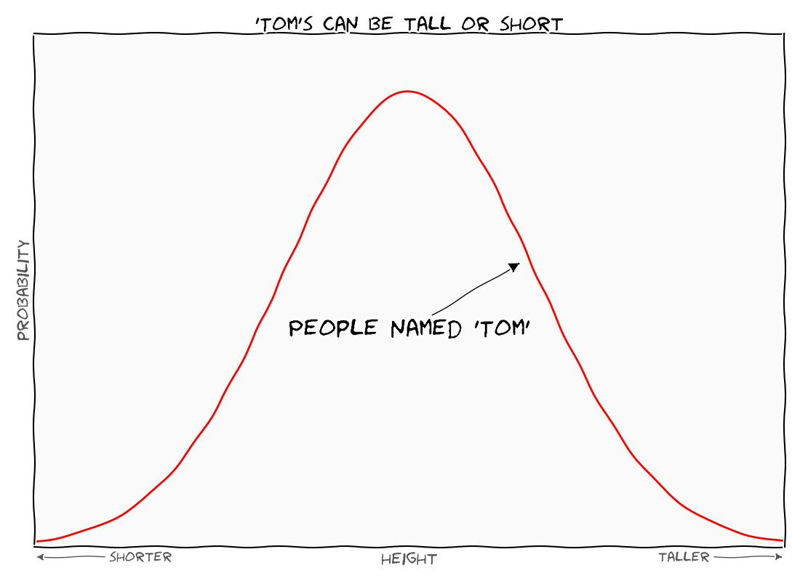

# FuzzyPlotting
Plotting utils for generating "fuzzy" plots. Fuzzy plots are plots that are qualitative, not quantitative. E.g. if you want to show that some quantity generally increases, but you don't want to get into numbers, the `FuzzyPlot` class can be used to show that. If you generated such a graph with numbers, then you have to get those numbers right. But with a fuzzy plot, you can think qualitatively.

The plots rely on `matplotlib`. They generally look like [XKCD](http://xkcd.com) plots.

# Usage

```python
import fuzzyplot

fuz = fuzzyplot.FuzzyPlot()

x,y = fuzzyplot.normal_data()

fuz.plot(x,y,color='r')

fuz.set_xlabel('height')
fuz.set_xlabel_side('shorter','left')
fuz.set_xlabel_side('taller','right')

fuz.set_ylabel('probability')

fuz.set_title("'Tom's can be tall or short")

fuz.arrow("People named 'Tom'", (0.5,0.2), (0.65,0.25))

fuz.set_ylim(0,0.5)
fuz.tight_layout()
```



